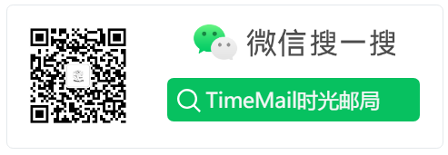

# 关于{docsify-ignore}

##  关于我们
  
- 1.该网站由怅屿时光工作室 和 XCSOFT共同运营，我们一定会尽力让您收到您发送的信件，因为那是您最宝贵的财富.
- 2.寄出的信是不可撤回的，希望你也忘掉这件事，直到你收到信的那一天.
- 3.在提交投递的那一刻我们将向你的邮箱发送一封确认邮件(未登录时)，只有点击确认邮件中的链接，您才能在未来收到邮件.

### 基础设施与其他信息

- 1.邮件服务采用 Aliyun 邮件推送、飞书企业邮.
- 2.后端采用 Workerman 框架, 使用 MySQL 作为数据载体, Redis 作为数据缓存.
- 3.您可以在[这些地方](find_us.md)找到我们.

### 关注我们或商务合作

## 版权归属

怅屿时光工作室 & XCSOFT 版权所有

## 联系方式

- xcsoft#timeletters.cn (使用@替换#)
